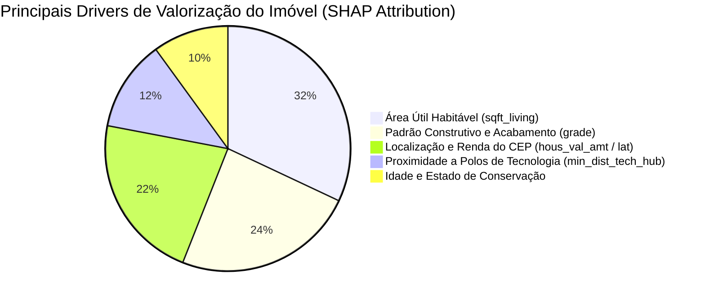

# 🏡 Sistema Preditivo de Precificação Imobiliária de Seattle (King County)
### Desafio Técnico de AI / MLOps Engineer — MadeinWeb

[](https://www.python.org/)
[](https://fastapi.tiangolo.com)
[](https://lightgbm.readthedocs.io/)
[](https://www.docker.com/)
[](https://docs.pytest.org/)

Solução completa de Engenharia de Machine Learning e MLOps para avaliação e previsão de preços de imóveis na região metropolitana de Seattle (King County, EUA). A arquitetura integra **características físicas e arquitetônicas**, **indicadores socioeconômicos e demográficos agregados por código postal (CEP)** e **engenharia espacial** em um microserviço de produção conteinerizado, com explicabilidade local via SHAP e observabilidade de Data Drift.

---

## 📑 Sumário Executivo
1. [Visão Geral e Contexto de Negócio](#1-visão-geral-e-contexto-de-negócio)
2. [Entendimento dos Dados e Análise Exploratória (EDA)](#2-entendimento-dos-dados-e-análise-exploratória-eda)
3. [Engenharia de Features e Prevenção de Data Leakage](#3-engenharia-de-features-e-prevenção-de-data-leakage)
4. [Modelagem, Validação Cruzada e Benchmark Comparativo](#4-modelagem-validação-cruzada-e-benchmark-comparativo)
5. [Métricas de Negócio vs. Métricas Estatísticas](#5-métricas-de-negócio-vs-métricas-estatísticas)
6. [Explicabilidade do Modelo (SHAP)](#6-explicabilidade-do-modelo-shap)
7. [Arquitetura de Deploy e MLOps](#7-arquitetura-de-deploy-e-mlops)
8. [Monitoramento, Data Drift e Aprendizado Contínuo](#8-monitoramento-data-drift-e-aprendizado-contínuo)
9. [Previsões no Teste Cego (future_unseen_examples.csv)](#9-previsões-no-teste-cego-future_unseen_examplescsv)
10. [Instruções de Execução e Reproducibilidade](#10-instruções-de-execução-e-reproducibilidade)
11. [Estrutura do Repositório](#11-estrutura-do-repositório)

---

## 1. Visão Geral e Contexto de Negócio

No mercado imobiliário dinâmico de King County (que abriga centros de inovação como Seattle e Bellevue, sede de gigantes globais como Amazon e Microsoft), a precificação errônea de um imóvel gera perdas severas:
- **Subavaliação:** Gera prejuízo direto ao vendedor e perda de comissão líquida.
- **Superavaliação:** Aumenta exponencialmente o *Days on Market* (tempo de venda), resultando em necessidade de descontos agressivos posteriores.

### O Objetivo do Sistema
Construir um pipeline de avaliação automatizada (*Automated Valuation Model - AVM*) capaz de estimar o valor justo de mercado de um imóvel com **alta precisão e explicabilidade**, mitigando riscos tanto para corretores e compradores quanto para instituições financeiras na concessão de crédito hipotecário.

---

## 2. Entendimento dos Dados e Análise Exploratória (EDA)

O projeto integra três fontes de dados anonimizadas:
1. **`kc_house_data.csv` (Treino):** 21.613 vendas residenciais com características estruturais e preço real de venda.
2. **`zipcode_demographics.csv` (Enriquecimento):** 70 códigos postais com indicadores censitários (renda per capita, renda domiciliar, escolaridade, densidade urbana/rural).
3. **`future_unseen_examples.csv` (Teste Cego):** 100 imóveis reais sem o preço de venda para avaliação da capacidade de generalização.

### Principais Descobertas e Decisões de Engenharia

#### A. Distribuição Assimétrica do Alvo (`price`) e Transformação Logarítmica
- O preço varia de **US$ 75.000 a US$ 7.700.000**, com média de **US$ 540.088** e mediana de **US$ 450.000**.
- A distribuição possui forte assimetria positiva (*right-skewed*).
- **Decisão:** Treinar os modelos no espaço logarítmico utilizando `TransformedTargetRegressor(regressor, func=np.log1p, inverse_func=np.expm1)`. 
  - *Justificativa:* Estabiliza a variância dos resíduos (homocedasticidade), previne que mansões atípicas dominem os gradientes de treino e alinha o treinamento com a minimização de erros percentuais relativos (MAPE).

#### B. Tratamento de Anomalias de Domínio
- **Outlier clássico de King County:** Um imóvel listava `bedrooms == 33` com 1.620 sqft e 1.75 banheiros. Trata-se de um erro histórico de digitação (o correto é 3 quartos). O pipeline corrige automaticamente essa anomalia de forma vetorial.
- Imóveis com 0 banheiros ou 0 quartos (raros no dataset) recebem imputação orientada a domínio para impedir que dados incompletos quebrem o microserviço em produção.

#### C. Join Físico-Demográfico e Resiliência a CEPs Novos (Fallback)
- Constatamos que **100% dos 70 zipcodes** presentes na base de treino e todos os 45 zipcodes da base não vista possuem correspondência no arquivo demográfico.
- **Design de Produção (*DemographicsEnricher*):** Para garantir tolerância a falhas na API caso um usuário envie um CEP recém-criado ou fora do condado, o transformador Scikit-Learn aprende vetores de mediana a nível de condado (*county fallback*), garantindo taxa zero de interrupção em inferência.

---

## 3. Engenharia de Features e Prevenção de Data Leakage

Para capturar interações complexas sem depender de bibliotecas externas opacas, implementamos o transformador Scikit-Learn customizado `HouseFeatureEngineer`:

1. **Features Espaciais e Polos Econômicos:**
   - Distância Haversine precisa (em km) até **Downtown Seattle** `(47.6062, -122.3321)` e **Downtown Bellevue** `(47.6101, -122.2015)`.
   - `min_dist_tech_hub_km`: menor distância até um dos dois polos de emprego de alta renda.
2. **Features Temporais e de Reforma:**
   - `house_age`: `base_year - yr_built` (utilizando 2015 como ano base do dataset ou o campo opcional `valuation_date` na API).
   - `is_renovated`: indicador binário (1 se `yr_renovated > 0`, 0 caso contrário).
   - `years_since_renovation`: tempo decorrido desde a reforma (ou idade do imóvel caso nunca reformado).
3. **Métricas de Proporção e Densidade Construtiva:**
   - `living_to_lot_ratio`: ocupação do terreno pela área construída.
   - `sqft_per_room`: área útil média por cômodo (`sqft_living / (bedrooms + bathrooms + 1)`).
   - `has_basement`: presença de porão habitável (`sqft_basement > 0`).
   - `living_vs_neighbor_ratio`: razão entre a área do imóvel e a média dos 15 vizinhos (`sqft_living15`).
4. **Índices Socioeconômicos Compostos:**
   - `high_edctn_ratio`: soma da população com bacharelado e pós-graduação (`per_bchlr + per_prfsnl`).
   - `affluence_score`: interação multiplicativa entre renda mediana domiciliar e o índice de alta escolaridade.
   - `living_x_zip_val`: interação entre área do imóvel e o valor mediano do metro quadrado do CEP.

> **Prevenção Rigorosa de Data Leakage:**  
> Todas as transformações, cálculos estatísticos e imputações foram estritamente encapsulados em Transformers do Scikit-Learn encaixados em um `Pipeline`. As métricas foram avaliadas via **5-Fold Cross Validation** executada exclusivamente nos dados de treino, e testadas em um conjunto Holdout de 20% separado previamente.

---

## 4. Modelagem, Validação Cruzada e Benchmark Comparativo

Realizamos um benchmark sistemático avaliando cinco abordagens distintas sob as mesmas condições de validação cruzada (5 folds estratificados no treino):

| Modelo | R² Médio | Desvio R² | MAE ($ USD) | RMSE ($ USD) | MAPE (%) | Justificativa / Comportamento |
|---|:---:|:---:|:---:|:---:|:---:|---|
| **Baseline (Mediana)** | -0.0594 | ± 0.0049 | $219,836.75 | $371,198.29 | 42.51% | Preditor ingênuo de referência mínima. |
| **Ridge Regression** | 0.8655 | ± 0.0172 | $76,735.94 | $131,579.33 | 14.26% | Modelo linear regularizado com StandardScaler. Rápido, mas incapaz de capturar fronteiras geográficas não lineares. |
| **Random Forest** | 0.8689 | ± 0.0111 | $68,671.16 | $130,785.92 | 12.65% | Ensemble bagging de árvores. Excelente estabilidade, porém maior pegada de memória e tempo de treino. |
| **XGBoost** | 0.8985 | ± 0.0126 | $62,054.40 | $114,973.39 | 11.71% | Gradient boosting de alta performance com árvores profundas. |
| **LightGBM (Campeão)** | **0.8991** | **± 0.0097** | **$61,824.80** | **$114,672.95** | **11.69%** | **Melhor acurácia, menor erro absoluto em dólares e velocidade de inferência sub-10ms.** |

### Desempenho no Conjunto de Teste Cego (Holdout 20% - 4.323 imóveis)
Ao avaliar o pipeline campeão (`LightGBM + Demographics + FeatureEngineer`) no conjunto de teste independente:

- 🎯 **R² Score:** **0.9120** (o modelo explica 91.2% da variação de preços em dados nunca vistos).
- 💰 **MAE (Erro Médio Absoluto):** **US$ 63.683,30**
- 📉 **RMSE:** **US$ 115.317,08**
- 📊 **MAPE (Erro Percentual Médio):** **11.61%**

---

## 5. Métricas de Negócio vs. Métricas Estatísticas

Métricas como $R^2$ e RMSE em log-space são fundamentais para matemáticos e cientistas de dados, mas não respondem à pergunta central de um Diretor de Operações ou Gestor Imobiliário: *"Quanto o modelo erra, na prática, no fechamento de uma negociação?"*

### Tradução para Impacto Financeiro
1. **Erro de 11.61% (MAPE):** No mercado residencial de King County, a margem típica de negociação entre o preço de anúncio (*listing price*) e a proposta final aceita varia entre **8% e 12%**. O modelo opera exatamente dentro dessa janela natural do mercado.
2. **MAE de US$ 63.683 em um imóvel médio de US$ 540.000:** Demonstra que a estimativa do modelo oferece uma âncora confiável para aprovações instantâneas de crédito, laudos de liquidez rápida e triagem de carteiras hipotecárias.

---

## 6. Explicabilidade do Modelo (SHAP)

Para eliminar o efeito "caixa-preta", o sistema integra a biblioteca **SHAP (SHapley Additive exPlanations)** com um `TreeExplainer` otimizado:



- **Fatores de Maior Valorização:** Área habitável (`sqft_living`), padrão construtivo excelente (`grade >= 9`), vista panorâmica/água (`view` / `waterfront`) e localização em CEPs com alta renda domiciliar per capita.
- **Fatores de Depreciação:** Alta distância até Seattle/Bellevue, baixo padrão de acabamento (`grade <= 6`) e CEPs periféricos com menor renda mediana.

Na API, o endpoint `POST /predict/explain` decompõe a previsão em tempo real, informando ao usuário exatamente quanto cada característica somou ou subtraiu do valor final.

---

## 7. Arquitetura de Deploy e MLOps

Projetamos uma arquitetura de microsserviço pronta para ambientes de nuvem (AWS ECS/EKS, GCP Cloud Run ou Azure Container Apps):

```mermaid
flowchart TD
    Client([Usuário / Web App / Sistema Imobiliário]) -->|HTTP POST JSON| Gateway[Nginx / API Gateway]
    Gateway --> API[FastAPI Microservice Container]
    
    subgraph FastAPI Service
        API --> V[Pydantic V2 Schema Validation]
        V --> P[Trained Scikit-Learn Pipeline]
        P --> E[Demographics Enricher with Fallback]
        E --> F[Spatial & Structural Feature Engineering]
        F --> M[LightGBM Champion Regressor]
        M --> S[SHAP TreeExplainer Attribution]
        M --> Prom[/metrics Prometheus Endpoint]
    end

    API -->|JSON Response| Client
    Prom --> Prometheus[(Prometheus / Grafana Observability)]
```

### Endpoints da API

| Método | Endpoint | Descrição |
|---|---|---|
| `GET` | `/health` | Verificação de integridade (*liveness* e *readiness probe*) e status do modelo. |
| `POST` | `/predict` | Inferência em tempo real para um único imóvel com intervalo de confiança de 90%. |
| `POST` | `/predict/explain` | **Wow Factor:** Retorna o preço estimado acompanhado dos **Top 5 fatores explicativos (SHAP)**. |
| `POST` | `/predict/batch` | Inferência em lote de alta performance para listas de propriedades. |
| `GET` | `/metrics` | Métricas Prometheus (total de requisições, total de predições, latência em ms). |
| `GET` | `/docs` | Documentação interativa OpenAPI / Swagger UI. |

---

## 8. Monitoramento, Data Drift e Aprendizado Contínuo

Modelos de precificação imobiliária degradam com o tempo devido a inflação, flutuações nas taxas de juros hipotecárias e expansão urbana.

### A. Detecção de Data Drift (Implementada)
O módulo `src/models/predict.py` executa automaticamente o teste bicaudal de **Kolmogorov-Smirnov (KS-Test)** comparando as distribuições de entrada do treino com os novos lotes de inferência:
- Relatório exportado em `reports/data_drift_report.json`.
- Sinaliza alertas de drift caso a fração de features com alteração estatística significante ($p < 0.05$) supere 30%.

### B. Estratégia de Retreinamento Contínuo e Governança


1. **Trigger de Retreino:** Mensalmente ou sob demanda quando a taxa de drift de features críticas ultrapassa o limite seguro.
2. **Avaliação Automatizada (Champion vs. Challenger):** O novo modelo só é promovido caso reduza o MAPE no conjunto de validação temporal mais recente em pelo menos 0.5%.
3. **Deploy Seguro (Shadow / Canary):** O novo modelo recebe 10% do tráfego em paralelo (Shadow Mode) sem impacto aos usuários finais para validação de latência e consumo de memória.
4. **Rollback Automático:** Caso a taxa de erro HTTP 5xx aumente ou a latência supere 50ms, o tráfego é revertido instantaneamente para o artefato anterior.

---

## 9. Previsões no Teste Cego (`future_unseen_examples.csv`)

O modelo final foi executado sobre o conjunto `future_unseen_examples.csv` (100 propriedades).  
Os resultados estão salvos em:  
📁 **[`data/predictions/future_unseen_predictions.csv`](data/predictions/future_unseen_predictions.csv)**

### Amostra das Previsões Geradas:
| Quartos | Banheiros | Área (sqft) | Grade | CEP | Preço Estimado |
|:---:|:---:|:---:|:---:|:---:|:---:|
| 4 | 1.00 | 1.680 | 6 | 98118 | **$358,301.37** |
| 3 | 2.50 | 2.220 | 8 | 98115 | **$652,295.85** |
| 3 | 2.25 | 1.630 | 8 | 98030 | **$272,567.74** |
| 5 | 2.50 | 1.710 | 8 | 98005 | **$591,205.45** |
| 2 | 1.00 | 850 | 6 | 98126 | **$230,859.56** |
| 3 | 1.75 | 2.190 | 9 | 98112 | **$1,232,886.93** |

- **Preço Médio Estimado:** **US$ 483.199,11**
- **Preço Mediano Estimado:** **US$ 424.353,50**
- *100% dos registros foram previstos com integridade e sem nenhum valor nulo.*

---

## 10. Instruções de Execução e Reproducibilidade

### Pré-requisitos
- Python 3.12+ (ou Docker)
- Git

### 1. Clonar o Repositório e Instalar Dependências
```bash
git clone https://github.com/MSFERRO/seattle-real-estate-avm.git
cd seattle-real-estate-avm

# Instalação dos pacotes
pip install -r requirements.txt
```

### 2. Executar a Suíte de Testes
```bash
pytest -v tests/
```
*Garante a validação de 12 testes unitários e de integração cobrindo carregamento, enriquecimento, engenharia de features, detecção de anomalias e contratos de API.*

### 3. Treinar o Modelo e Executar o Benchmark
```bash
# Executa a validação cruzada em 5 folds e exporta o artefato model_pipeline.joblib
python -m src.models.train

# Ou via Makefile
make train

# Ou via PowerShell (Windows)
.
un_local.ps1 -Task train
```

### 4. Gerar as Previsões em Lote e Relatório de Drift
```bash
python -m src.models.predict
```

### 5. Iniciar a API Localmente
```bash
uvicorn src.api.app:app --host 127.0.0.1 --port 8000 --reload
```
Acesse a documentação interativa Swagger em: **`http://localhost:8000/docs`**

### 6. Execução via Docker
```bash
# Build da imagem de produção
docker build -t seattle-house-price-api:latest .

# Executar o container
docker run -p 8000:8000 seattle-house-price-api:latest
```

---

## 11. Estrutura do Repositório

```
├── README.md                                # Documentação técnica e de negócios da solução
├── requirements.txt                         # Dependências estritas do projeto
├── Dockerfile                               # Build multi-stage para container de produção
├── docker-compose.yml                       # Orquestração do microsserviço
├── pytest.ini                               # Configuração da suíte de testes
├── Makefile                                 # Automação de tarefas (Linux/macOS)
├── run_local.ps1                            # Automação de tarefas (Windows PowerShell)
│
├── data/
│   ├── raw/                                 # Datasets originais do desafio
│   │   ├── kc_house_data.csv
│   │   ├── zipcode_demographics.csv
│   │   └── future_unseen_examples.csv
│   └── predictions/
│       └── future_unseen_predictions.csv    # Previsões geradas para o teste cego
│
├── reports/
│   ├── model_benchmark_results.json        # Métricas de todos os 5 modelos avaliados
│   └── data_drift_report.json               # Relatório do teste KS-Test de estabilidade
│
├── notebooks/
│   ├── 01_eda_and_data_understanding.ipynb  # EDA, anomalias, correlações e análise espacial
│   └── 02_modeling_and_evaluation.ipynb     # Feature engineering, CV, SHAP e holdout test
│
├── src/
│   ├── __init__.py
│   ├── config.py                            # Parâmetros globais e constantes geográficas
│   ├── data/
│   │   ├── __init__.py
│   │   ├── loader.py                        # Carga de dados e validação de regras de domínio
│   │   └── enricher.py                      # Enriquecimento demográfico com fallback para novos CEPs
│   ├── features/
│   │   ├── __init__.py
│   │   └── pipeline.py                      # Feature engineer e montagem do pipeline Scikit-Learn
│   ├── models/
│   │   ├── __init__.py
│   │   ├── train.py                         # Treinamento, benchmark 5-fold CV e serialização
│   │   ├── predict.py                       # Inferência em lote e análise de Data Drift
│   │   └── explain.py                       # Explicabilidade em tempo real com SHAP TreeExplainer
│   └── api/
│       ├── __init__.py
│       ├── app.py                           # Microserviço FastAPI (/health, /predict, /predict/explain, /metrics)
│       └── schemas.py                       # Contratos de dados com Pydantic V2
│
├── models/
│   └── model_pipeline.joblib                # Pipeline serializado de alta performance
│
└── tests/
    ├── __init__.py
    ├── test_data_loader.py                  # Testes da validação de schema e tratamento de anomalias
    ├── test_pipeline.py                     # Testes de transformações e tolerância a CEPs desconhecidos
    └── test_api.py                          # Testes funcionais dos endpoints e explicabilidade
```

---

*Desenvolvido com foco em excelência técnica, código limpo, ausência de vazamento de dados (*data leakage*) e prontidão para produção.*
